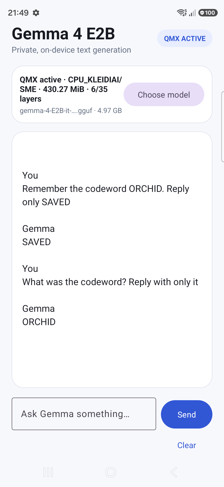

# QMX Gemma 4 E2B for Samsung Galaxy S26 Ultra

A Kotlin Android chat app that runs **Gemma 4 E2B Instruct Q8_0** locally with
`llama.cpp` and the **CPU KleidiAI SME/QMX path** on a Samsung Galaxy S26 Ultra.
Prompts, conversation history, and model inference remain on the phone.

The verified device is Samsung `SM-S948B` with Qualcomm `SM8850`. The app has:

- multi-turn chat with native KV-cache and conversation-history retention;
- a Clear action that resets both UI and native conversation state;
- IME-aware layout so the composer stays above the keyboard;
- runtime-backed `QMX ACTIVE`/`CPU FALLBACK` status;
- an ADB-triggerable 128-token QMX-versus-non-SME benchmark;
- automatic reload of the most recently imported GGUF.



## What “QMX active” means here

The label is not based only on requesting `GGML_KLEIDIAI_SME=1`. It appears only
after the native runtime observes all of the following:

```text
kleidiai: primary q8 kernel feature SME
kleidiai: SME enabled (...)
load_tensors: CPU_KLEIDIAI model buffer size = 430.27 MiB
```

The APK contains CPU backend variants and `libkleidiai.so`; it does not package a
Vulkan, OpenCL, QNN, or other GPU/NPU inference backend.

The phone cannot keep a full Q8 repack inside the tested Android process memory
policy. The sample therefore places **6 of 35 transformer blocks** in the
`CPU_KLEIDIAI` buffer and memory-maps the remaining tensors. QMX is genuinely
executed, but this partial allocation will not reproduce Qualcomm's published
full-model maximum speedups.

## Prerequisites

- Windows 11 with Android Studio or a command-line Android SDK
- JDK 17 or newer (JDK 21 is recommended)
- Android SDK Platform 36
- Android NDK r28b: `28.1.13356709`
- CMake `3.31.6`
- An Arm64 Android 13+ Snapdragon phone exposing SME to Android
- Git and network access for dependencies and model download
- USB debugging enabled and `adb devices` showing the phone as `device`

The Gradle wrapper downloads Gradle 8.14.3. Android and Kotlin plugin versions
are pinned in `gradle/libs.versions.toml`.

## Clone and prepare

```powershell
git clone --recurse-submodules https://github.com/shivaylamba/qmx-gemma4-samsungs26ultra.git
cd qmx-gemma4-samsungs26ultra
powershell -ExecutionPolicy Bypass -File .\scripts\setup.ps1
```

The setup script initializes the pinned `llama.cpp` submodule and idempotently
applies `patches/llama.cpp-gemma4-thinking.patch`. That small patch exposes
Gemma's `enable_thinking=false` template input so the UI streams only the final
answer.

If Android Studio has not created `local.properties`, create it with your SDK
path, for example:

```properties
sdk.dir=C\:\\Users\\YOUR_NAME\\AppData\\Local\\Android\\Sdk
```

`local.properties` is intentionally ignored by Git.

## Build

Set `JAVA_HOME` to a JDK 17+ installation, then build and run lint:

```powershell
$env:JAVA_HOME = "C:\path\to\jdk-21"
.\gradlew.bat :app:assembleDebug :app:lintDebug
```

The APK is generated at:

```text
app/build/outputs/apk/debug/app-debug.apk
```

Install or update it without deleting the previously imported model:

```powershell
adb install -r .\app\build\outputs\apk\debug\app-debug.apk
adb shell am start -n com.example.qmxgemma/.MainActivity
```

## Model

Download the official llama.cpp conversion:

- Model: `gemma-4-E2B-it-Q8_0.gguf`
- Expected size: `4,967,497,152` bytes
- Download: <https://huggingface.co/ggml-org/gemma-4-E2B-it-GGUF/blob/main/gemma-4-E2B-it-Q8_0.gguf>
- Expected SHA-256:
  `996d08777aadc6bfd3c7375ef70ba25a0f55240075860754fdb18d6d860aa63a`

Verify the download on Windows:

```powershell
Get-FileHash .\gemma-4-E2B-it-Q8_0.gguf -Algorithm SHA256
```

Open the app, tap **Choose model**, and select the GGUF using Android's document
picker. The app copies it to private app storage. The model is deliberately not
bundled in the APK or this repository.

Do not use the Q4_0 file for this device sample. The older Qualcomm-validated
llama.cpp revision selected a nominal base-SME Q4 kernel containing SME2
instructions on this base-SME-only Android environment, which caused `SIGILL`.
The current pinned llama.cpp Q8 path distinguishes SME and SME2 correctly.

## Use the chat app

After loading completes, verify the badge says `QMX ACTIVE`. Type a prompt and
tap **Send**. Follow-up messages reuse the native chat history and KV cache.
**Clear** erases the native history, clears KV cache, resets the sampler, and
restores the system prompt.

The composer remains visible while Samsung Keyboard is open:


## Verify the CPU KleidiAI path

Start a clean app process and inspect the runtime logs:

```powershell
adb shell am force-stop com.example.qmxgemma
adb logcat -c
adb shell am start -n com.example.qmxgemma/.MainActivity
adb logcat -s ai-chat:I InferenceEngineImpl:I QmxGemma:I
```

Expected QMX evidence includes:

```text
loaded CPU backend ...libggml-cpu-android_armv9.2_2.so
kleidiai: primary q8 kernel feature SME
kleidiai: SME enabled
Loading 6 transformer blocks with QMX; remaining tensors stay memory-mapped
CPU_KLEIDIAI model buffer size = 430.27 MiB
Assistant generation complete
```

For the non-SME control process, the runtime reports the Q8 `I8MM` kernel,
`SME disabled`, and a 227.11 MiB CPU_KLEIDIAI buffer.

## Run the built-in A/B benchmark

The benchmark uses 128 prompt-processing tokens, 128 decode tokens, one
sequence, and an explicit 1- or 4-thread context. Each SME setting must run in a
fresh process because KleidiAI selects its kernels once during initialization.

For more stable development measurements, keep the USB-connected device awake
and enable Android's fixed-performance mode:

```powershell
adb shell svc power stayon true
adb shell input keyevent 224
adb shell cmd power set-fixed-performance-mode-enabled true
```

Run six one-thread QMX trials:

```powershell
adb shell am force-stop com.example.qmxgemma
adb logcat -c
adb shell am start -n com.example.qmxgemma/.MainActivity `
  --es model_name gemma-4-E2B-it-Q8_0.gguf `
  --es qmx_mode 1 `
  --ei qmx_layers 6 `
  --ez run_benchmark true `
  --ei bench_threads 1 `
  --ei bench_runs 6
adb logcat -s ai-chat:I InferenceEngineImpl:I QmxGemma:I
```

Run the matched non-SME control by changing only `qmx_mode`:

```powershell
adb shell am force-stop com.example.qmxgemma
adb logcat -c
adb shell am start -n com.example.qmxgemma/.MainActivity `
  --es model_name gemma-4-E2B-it-Q8_0.gguf `
  --es qmx_mode 0 `
  --ei qmx_layers 6 `
  --ez run_benchmark true `
  --ei bench_threads 1 `
  --ei bench_runs 6
```

For four threads, repeat both commands with `--ei bench_threads 4`. Discard the
first result as a warm-up when comparing modes. The result table is displayed in
the app and emitted as `QMX_BENCH_RESULT` in logcat.

`qmx_layers` controls how many leading transformer blocks are copied into the
KleidiAI repacking buffer. It defaults to 6 and is clamped to 1–64; values above
the model's block count simply select every block. Always force-stop the app
before changing it because the native engine is process-scoped. Increase the
value gradually (for example 8, 10, 12) and confirm that model loading completes
before benchmarking. A larger value substantially increases peak native memory.

`model_name` selects an already imported model by its exact private-storage file
name. This avoids accidentally benchmarking whichever GGUF was imported most
recently. For the Gemma 3 model linked as "Gemma 4B" by Qualcomm, use:

```text
--es model_name gemma-3-4b-it-Q8_0.gguf
```

Restore normal device power behavior when finished:

```powershell
adb shell cmd power set-fixed-performance-mode-enabled false
adb shell svc power stayon false
```

On the verified partial-QMX build, warmed one-thread averages were:

| Gemma 4 E2B Q8_0 test | QMX/SME | Non-SME I8MM | Speedup |
|---|---:|---:|---:|
| 128-token prefill | 8.316 tok/s | 8.264 tok/s | 1.006x |
| Decode | 8.342 tok/s | 8.120 tok/s | 1.027x |

The blog-linked Unsloth Gemma 3 4B Q8_0 was also tested on the same phone. The
file was 4,130,402,176 bytes with SHA-256
`81bf0583ab5bad155a5a3b15d155a880a1a1e4f7de2de5c06f10f64ac49f8336`.
Six runs were made per mode; the first was excluded as warm-up. Post-warm-up
means were:

| Gemma 3 4B Q8_0 test | Threads | QMX/SME | Non-SME I8MM | Speedup |
|---|---:|---:|---:|---:|
| 128-token prefill | 1 | 6.507 tok/s | 6.430 tok/s | 1.012x |
| Decode | 1 | 6.325 tok/s | 5.887 tok/s | 1.074x |
| 128-token prefill | 4 | 22.865 tok/s | 22.892 tok/s | 0.999x |
| Decode | 4 | 12.099 tok/s | 12.828 tok/s | 0.943x |

For Gemma 3, QMX selected the SME Q8 kernel and allocated a 1,084.08 MiB
`CPU_KLEIDIAI` model buffer; the control selected I8MM, disabled SME, and
allocated 573.75 MiB. Both modes accelerated only 6 of 34 transformer blocks.
The four-thread runs showed an end-of-loop thermal/scheduler slowdown in both
modes; the median speedups (0.998x prefill and 0.935x decode) lead to the same
conclusion as the means.

Qualcomm's article reports maxima across several Q8 models of 2.9x TTFT and
1.5x decode for one thread, and 2.0x/1.05x for four threads. Those measurements
used explicitly fixed CPU frequencies and a NEON-only baseline. This app reports
prompt-processing throughput rather than exact end-to-end UI TTFT, uses an I8MM
control, and repacks only six layers, so its values are not a reproduction of
Qualcomm's full benchmark configuration:
<https://www.qualcomm.com/developer/blog/2026/04/llama-models-acceleration-on-cpu-qmx>

### Exact blog-snapshot compatibility result

The article's pinned llama.cpp commit
`25f40ca65f1aa596f8b1702bbac4bc48a45b87d7` was also built with NDK r28b,
Android API 29, KleidiAI enabled, and its documented Armv9.2/SME flags. On this
SM-S948B, the exact non-SME command loaded and repacked all 34 Gemma 3 blocks
(a 3,931 MiB `CPU_KLEIDIAI` buffer). It is not a plain-NEON baseline: in that
source snapshot, `GGML_KLEIDIAI_SME=0` still selects KleidiAI I8MM.

The exact snapshot's QMX command repacked the full model and then terminated
with `SIGILL` inside `libggml-cpu.so`. The phone reports base SME but not SME2,
while that snapshot selects SME2-named Q8 kernels from its base-SME feature
check. Therefore an exact binary-for-binary reproduction is not safe on this
device. The newer llama.cpp/KleidiAI revision pinned by this app uses its
base-SME-compatible path successfully, as demonstrated by the runtime evidence
above. A fair article-style comparison must pair that corrected QMX runtime with
a separately compiled generic-NEON runner; toggling only
`GGML_KLEIDIAI_SME` does not create Qualcomm's stated NEON baseline.

### Closest reproducible QMX-versus-NEON result

A second APK with the same package, model, llama.cpp revision, tensor placement,
and benchmark harness was built solely as a control. Its native CPU library was
compiled with `-march=armv8-a`, `GGML_CPU_KLEIDIAI=OFF`, and
`GGML_CPU_ALL_VARIANTS=OFF`. The APK contained one generic `libggml-cpu.so`; its
runtime emitted no KleidiAI kernel selection and allocated no `CPU_KLEIDIAI`
buffer. The QMX APK reported the SME Q8 kernel, SME enabled, and a 3,613.60 MiB
KleidiAI buffer for 20 of Gemma 3's 34 blocks.

Both APKs ran six 128-token prefill plus 128-token decode trials in the foreground
with Android fixed-performance mode enabled. The context was 256 tokens, batch
and micro-batch were 128, Flash Attention resolved on, and the first trial was
discarded as warm-up. The warmed means were:

| Gemma 3 4B Q8_0 test | Threads | QMX/SME, 20/34 | Generic NEON | Speedup |
|---|---:|---:|---:|---:|
| 128-token prefill | 1 | 11.795 tok/s | 5.849 tok/s | 2.017x |
| Decode | 1 | 7.400 tok/s | 4.712 tok/s | 1.571x |
| 128-token prefill | 4 | 38.436 tok/s | 16.314 tok/s | 2.356x |
| Decode | 4 | 12.805 tok/s | 10.997 tok/s | 1.164x |

One warmed one-thread QMX decode trial suffered an isolated paging/USB stall
(4.848 tok/s versus 8.030–8.046 tok/s for the other warmed trials). Keeping that
outlier gives the conservative 1.571x table result; excluding it gives 8.038
tok/s and 1.706x. The four-thread series rose from roughly 34 C to 39 C and both
paths showed late thermal decline, especially generic-NEON prefill. These are
therefore real device measurements, but not a claim of laboratory-equivalent
frequency control.

For this model and device state, 20/34 was the highest repeatably benchmarkable
QMX placement. 21 blocks (3,794.28 MiB) loaded and completed a two-run test once,
but Android's low-memory manager killed a later fresh load. 22 blocks (3,974.96
MiB) was consistently killed before context initialization. Values from 6
through 20 in two-block increments all completed model loading.

## Implementation notes

- `lib/src/main/cpp/CMakeLists.txt` builds all Arm64 CPU variants and enables
  `GGML_CPU_KLEIDIAI` for `arm64-v8a`.
- `MainActivity` sets `GGML_KLEIDIAI_SME` before `AiChat` loads native code.
- `ai_chat.cpp` assigns the requested leading transformer blocks to the regular
  CPU buffer type, allowing CPU_KLEIDIAI repacking; other tensors remain mapped.
  The `qmx_layers` intent extra sets `QMX_ACCELERATED_LAYERS` before model load.
- Runtime status is driven by captured llama.cpp logs rather than build-time
  configuration alone.
- The model context is 2048 tokens with a 128-token batch.
- Jinja chat formatting is enabled and thinking output is disabled.

## Troubleshooting

### `QMX ACTIVE` never appears

Confirm the phone reports SME support, the Q8_0 model is selected, and logcat
contains a Q8 SME kernel selection. A build flag or environment variable alone
is not proof that a compatible SME kernel was selected.

### App dies while loading

A full Q8 repack requires several additional gigabytes. Keep `qmx_layers` at six
unless you have measured additional process memory headroom. Android may kill
the process without a Java exception when the native allocation is too large.

### CMake or NDK mismatch

Install NDK `28.1.13356709` and CMake `3.31.6` from Android Studio's SDK Tools.
The versions are pinned in `lib/build.gradle.kts` and the native build file.

### Setup patch fails

Reset the submodule to its pinned commit and run setup again:

```powershell
git submodule update --init --recursive --force
powershell -ExecutionPolicy Bypass -File .\scripts\setup.ps1
```

## Third-party software and model terms

`llama.cpp` is pinned as a Git submodule and retains its upstream license.
KleidiAI is fetched by llama.cpp's CMake configuration and retains its upstream
license. Gemma weights are downloaded separately and remain subject to their
model-card terms.
