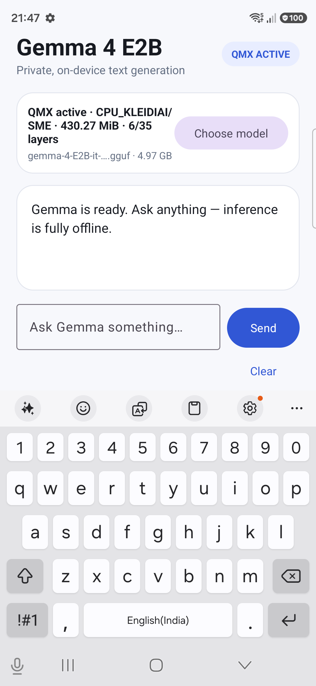

# QMX Gemma 4 E2B for Samsung Galaxy S26 Ultra

A Kotlin Android chat app that runs **Gemma 4 E2B Instruct Q8_0** locally with
`llama.cpp` and the **CPU KleidiAI SME/QMX path** on a Samsung Galaxy S26 Ultra.
Prompts, conversation history, and model inference remain on the phone.

This build pins Qualcomm's [`kleidi-ai-qmx`](https://github.com/qualcomm/kleidiai/tree/kleidi-ai-qmx)
source at commit `8316de1358b5c3589120af0f3d99477e7c16b2e7` and replaces
llama.cpp's normal fetched KleidiAI release at CMake configure time. An
app-owned patch binds the pinned upstream llama.cpp Q8 SME1 GEMM and GEMV
dispatch to Qualcomm's explicit `qmx_mopa` and `qmx_dot` symbols. No llama.cpp
fork or upstream pull request is required.

The verified device is Samsung `SM-S948B` with Qualcomm `SM8850`. Its Android
CPU feature list contains `sme` and the SME1 matrix data types but not `sme2`,
so the tested QMX dispatch is SME1. The app has:

- multi-turn chat with native KV-cache and conversation-history retention;
- a Clear action that resets both UI and native conversation state;
- IME-aware layout so the composer stays above the keyboard;
- runtime-backed `QMX ACTIVE`/`CPU FALLBACK` status;
- an in-app, persistent Hugging Face download with progress, cancellation, and
  SHA-256 verification;
- an ADB-triggerable 128-token QMX-versus-non-SME benchmark;
- model-aware, live-memory-aware selection of QMX-repacked transformer blocks;
- automatic reload of the most recently imported or downloaded GGUF.

The interface uses the project's original light blue, white, and soft-gray
visual language. Runtime details sit in a restrained on-device status card,
while the conversation uses labeled full-width messages and an IME-safe
composer that remains visible above the keyboard. Streamed output is batched
into display frames and updates only the active message text, avoiding a full
row rebind and forced scroll for every token. Displayed acceleration values
come from the native runtime; the UI does not show estimated or hard-coded
token speeds.

For a source-level comparison with Kartikey's QMX-CPU sample, including why a
270M model does not need the same layer planner as a 4B Android app, see
[`docs/qmx-cpu-comparison.md`](docs/qmx-cpu-comparison.md).

## What “QMX active” means here

The label is not based only on requesting `GGML_KLEIDIAI_SME=1`. The strongest
runtime proof is the complete sequence below:

```text
kleidiai: primary q8 kernel feature SME
kleidiai: Qualcomm QMX Q8 SME1 kernels selected (qmx_mopa + qmx_dot)
kleidiai: SME enabled (...)
load_tensors: CPU_KLEIDIAI model buffer size = 430.27 MiB
kleidiai: executing Qualcomm QMX Q8 SME1 GEMM/prefill kernel (...)
kleidiai: executing Qualcomm QMX Q8 SME1 GEMV/decode kernel (...)
```

The last two lines are emitted inside the KleidiAI execution path immediately
before the selected kernel's run function is invoked. They confirm real QMX
execution for prefill and decode rather than only successful kernel selection.

The APK contains CPU backend variants and `libkleidiai.so`; it does not package a
Vulkan, OpenCL, QNN, or other GPU/NPU inference backend.

`CPU_KLEIDIAI` is normal app process memory, typically backed by DRAM, that
holds repacked model weights in the layout used by KleidiAI's QMX/SME CPU
kernels. It is not L2 cache. QMX does not accelerate every operation in Gemma or
Llama; it primarily targets supported linear projection work such as GEMM/GEMV.
Other model work, including parts of attention during decode, still runs on CPU
paths outside the QMX-friendly kernels.

The phone cannot keep every supported Q8 tensor repacked inside this full
Android app process at all settings. The normal app path therefore selects the
layer count automatically. It first loads a two-layer calibration probe, reads
the real `CPU_KLEIDIAI` allocation, combines that model-specific packing density
with Android's current available memory, the GGUF size, low-memory threshold,
KV/app reserve, and a 25% safety margin, then reloads with the calculated count.
The remaining tensors stay memory-mapped. Controlled benchmarks can still set
an explicit layer count through ADB.

## Prerequisites

- Windows 11 with Android Studio or a command-line Android SDK
- JDK 21
- Android SDK Platform 36
- Android NDK r28b: `28.1.13356709`
- CMake `3.31.6`
- An Arm64 Android 13+ Snapdragon phone exposing SME to Android
- Git and network access for dependencies and model download
- USB debugging enabled and `adb devices` showing the phone as `device`

The Gradle wrapper downloads Gradle 8.14.3. Android and Kotlin plugin versions
are pinned in `gradle/libs.versions.toml`.

## QMX Voice Lab APK

This repository also contains a separate `voice-app` application for testing
on-device text-to-speech latency. It uses llama.cpp's first-class Qwen3-TTS
pipeline with these files from
[`ggml-org/Qwen3-TTS-12Hz-1.7B-Base-GGUF`](https://huggingface.co/ggml-org/Qwen3-TTS-12Hz-1.7B-Base-GGUF):

- `Qwen3-TTS-12Hz-1.7B-Base-Q8_0.gguf`, 1,847,874,400 bytes
- `mmproj-Qwen3-TTS-12Hz-1.7B-Base-Q8_0.gguf`, 446,422,912 bytes

The model files are not packaged in the APK. The app downloads both files from
Hugging Face, checks their exact sizes and SHA-256 hashes, and keeps them in
app-specific storage. The downloader resumes partial files and remains attached
when Android recreates the Activity. Raw `adb push` or `run-as` copies into this
directory are not a supported installation method because Android 16 scoped
storage can expose a different mount view to the application. Use the in-app
download flow for a reproducible installation.

Build and install the voice APK:

```powershell
$env:JAVA_HOME = "C:\path\to\jdk-21"
.\gradlew.bat :voice-app:assembleDebug
adb install -r .\voice-app\build\outputs\apk\debug\voice-app-debug.apk
```

The app provides single synthesis runs and a matched 1-thread versus 4-thread
comparison. It reports prompt prefill, the first generated audio-frame proxy,
time until the complete WAV is available, audio duration, and real-time factor.
This standalone voice lab still plays the completed WAV. The combined assistant
described below uses the repository's incremental PCM callback instead.

QMX coverage is deliberately reported per stage. Every transformer block in
the Q8_0 backbone is targeted dynamically by tensor name, without a hard-coded
layer count. The published backbone reports architecture `qwen3tts`, 28 blocks,
196 two-dimensional Q8_0 block-weight tensors, and 112 F32 block vectors. QMX
can accept the eligible Q8_0 matrix operations; F32 normalization vectors and
unsupported operations follow ordinary CPU paths. A successful test must
observe all of the following at runtime:

```text
kleidiai: primary q8 kernel feature SME
load_tensors: CPU_KLEIDIAI model buffer size = ...
kleidiai: executing Qualcomm QMX Q8 SME1 GEMM/prefill kernel (...)
kleidiai: executing Qualcomm QMX Q8 SME1 GEMV/decode kernel (...)
```

The Q8 backbone's eligible linear matrix operations can use QMX. The audio
projector and waveform decoder are loaded by `libmtmd` and currently remain on
ordinary CPU paths, as do sampling and non-matrix operators. The UI distinguishes
QMX selection from actual GEMM and GEMV execution so a fallback cannot appear as
a successful QMX result.

## Combined QMX Voice Assistant APK

The `assistant-app` module combines Gemma 4 E2B chat with two selectable speech
backends in one Kotlin application:

- **Qwen3-TTS Q8** runs through llama.cpp and Qualcomm KleidiAI. Supported Q8
  linear operations use the QMX/SME CPU kernels, while the projector, decoder,
  and unsupported operations use ordinary CPU paths.
- **KittenTTS Nano 0.8 FP32** runs through ONNX Runtime 1.29.0. Its session
  explicitly registers `CPUExecutionProvider` and does not register QNN, NNAPI,
  GPU, or XNNPACK. This is a Snapdragon CPU comparison path, not a QMX path.

The voice selector persists the user's choice. The benchmark button performs a
matched warm-up and measured synthesis at one and four threads for whichever
voice is selected, then saves the faster thread setting. The tested Kitten path
uses the Jasper voice at 24 kHz and returns a complete waveform before playback.

Gemma and the Qwen Q8 model are deliberately not resident at the same time. A co-resident
device experiment was terminated by Android's low-memory killer after swap
usage reached roughly 8.3 GB. The production coordinator therefore performs a
sequential handoff:

1. Gemma generates the text response.
2. Gemma and its QMX-packed buffer are unloaded and the native heap is purged.
3. Qwen3-TTS loads, synthesizes and begins PCM playback as decoder chunks become
   available, then unloads and purges after completing the WAV.
4. Gemma reloads with a bounded textual reconstruction of the conversation so
   follow-up questions retain context.

Kitten is only about 60 MB of downloaded model and voice data, so its ONNX CPU
session remains resident beside Gemma. Selecting Kitten therefore avoids the
Gemma-to-Qwen unload/reload handoff while preserving Gemma conversation state.

This build assigns two Gemma blocks to the `CPU_KLEIDIAI` buffer. For Qwen3-TTS,
it first proves QMX with a four-block probe, measures the actual packed MiB per
block, reads Android's currently available memory, keeps explicit system and
runtime reserves, and selects the largest safe block count dynamically. This is
a memory budget, not a claim that every operation in a selected block uses QMX.
Unsupported tensors and operators continue on ordinary CPU paths. Startup
requires runtime evidence for both the QMX GEMM/prefill and GEMV/decode entry
points before it reports the voice path as proven.

For Qwen, the **Benchmark selected voice** button uses the same text, seed, QMX
plan, and frame cap and compares real-time factor so small output-duration
differences do not bias the selection. Its first-playable latency is measured
when the first PCM chunk is emitted. For Kitten, the same button creates explicit
one-thread and four-thread ONNX CPU sessions and compares their real-time factors;
because this ONNX graph returns the complete waveform, first-playable latency is
currently the completed-WAV latency.

Build and install the combined APK:

```powershell
$env:JAVA_HOME = "C:\path\to\jdk-21"
.\gradlew.bat :assistant-app:testDebugUnitTest :assistant-app:lintDebug :assistant-app:assembleDebug
adb install -r .\assistant-app\build\outputs\apk\debug\assistant-app-debug.apk
adb shell am start -n com.example.qmxassistant/.MainActivity
```

The APK is only the application and native runtimes. It packages the QMX-enabled
llama.cpp/KleidiAI libraries, ONNX Runtime, and the Kitten phonemizer, but no
model weights. After installation the app downloads and SHA-256 verifies
7.32 GB in app-specific external storage:

- Gemma 4 E2B Q8 GGUF: 4,967,497,152 bytes
- Qwen3-TTS Q8 backbone and projector GGUFs: 2,294,297,312 bytes combined
- KittenTTS Nano 0.8 FP32 ONNX and voices: 60,045,997 bytes combined
- pinned English phonemizer rule/list data: 264,479 bytes combined

The Kitten model is pinned to Hugging Face revision
`7a1db645b1f3ab9420761d87428e042b9cec3f26`; its native phonemizer source is
pinned to KittenML's Apache-2.0 Flutter implementation at commit
`00d8286ff51409387c5e1c15eb3057506280334a`. The phonemizer dictionaries are
pinned to espeak-ng commit `59eb19938f12e30881c81d86ce4a7de25414c9f4`.
Uninstalling the app removes the downloaded files.

## Clone and prepare

```powershell
git clone --recurse-submodules https://github.com/shivaylamba/qmx-gemma4-samsungs26ultra.git
cd qmx-gemma4-samsungs26ultra
powershell -ExecutionPolicy Bypass -File .\scripts\setup.ps1
```

The setup script initializes the pinned upstream llama.cpp submodule. The QMX
patch makes llama.cpp download the pinned Qualcomm KleidiAI commit directly.
The script idempotently applies three app-owned patches from `patches/`: the
QMX SME1 kernel binding, the small Gemma
`enable_thinking=false` template change, and the Qwen3-TTS incremental PCM
decoder interface.

If Android Studio has not created `local.properties`, create it with your SDK
path, for example:

```properties
sdk.dir=C\:\\Users\\YOUR_NAME\\AppData\\Local\\Android\\Sdk
```

`local.properties` is intentionally ignored by Git.

## Build

Set `JAVA_HOME` to a JDK 21 installation, then build and run lint:

```powershell
$env:JAVA_HOME = "C:\path\to\jdk-21"
.\gradlew.bat :app:assembleDebug :app:lintDebug
```

The APK is generated at:

```text
app/build/outputs/apk/debug/app-debug.apk
```

Install or update it without deleting the previously imported model:

```powershell
adb install -r .\app\build\outputs\apk\debug\app-debug.apk
adb shell am start -n com.example.qmxgemma/.MainActivity
```

## Model

The app can download the tested official llama.cpp conversion directly from
Hugging Face:

- Model: `gemma-4-E2B-it-Q8_0.gguf`
- Expected size: `4,967,497,152` bytes
- Download: <https://huggingface.co/ggml-org/gemma-4-E2B-it-GGUF/blob/main/gemma-4-E2B-it-Q8_0.gguf>
- Expected SHA-256:
  `996d08777aadc6bfd3c7375ef70ba25a0f55240075860754fdb18d6d860aa63a`

Tap **Download model**, review the 4.97 GB confirmation, and tap **Download**.
Android's persistent download service performs the transfer, so it continues
if the Activity is recreated or the app process is restarted. The UI reports
downloaded bytes and supports cancellation. Before llama.cpp sees the file, the
app checks both its exact size and SHA-256. A failed verification deletes the
file instead of attempting to load it.

The downloaded model is stored in this app's external-files directory and is
removed when the app is uninstalled. It is not executable code and is not
included in the APK. The llama.cpp, ggml, KleidiAI, and JNI native libraries
remain packaged inside the APK.

For a manual download, verify the file on Windows:

```powershell
Get-FileHash .\gemma-4-E2B-it-Q8_0.gguf -Algorithm SHA256
```

Then tap **Choose model** and select the GGUF using Android's document picker.
The app copies manually selected models to private app storage. This remains a
fallback for offline installation or compatible custom GGUF files.

Do not use the Q4_0 file for this device sample. The older Qualcomm-validated
llama.cpp revision selected a nominal base-SME Q4 kernel containing SME2
instructions on this base-SME-only Android environment, which caused `SIGILL`.
The current pinned llama.cpp Q8 path distinguishes SME and SME2 correctly.

## Use the chat app

After loading completes, verify the badge says `QMX ACTIVE`. Type a prompt and
tap **Send**. Follow-up messages reuse the native chat history and KV cache.
**Clear** erases the native history, clears KV cache, resets the sampler, and
restores the system prompt.

The composer remains visible while Samsung Keyboard is open:



## Verify the CPU KleidiAI path

Start a clean app process and inspect the runtime logs:

```powershell
adb shell am force-stop com.example.qmxgemma
adb logcat -c
adb shell am start -n com.example.qmxgemma/.MainActivity
adb logcat -s ai-chat:I InferenceEngineImpl:I QmxGemma:I
```

Expected QMX evidence includes:

```text
loaded CPU backend ...libggml-cpu-android_armv9.2_2.so
kleidiai: primary q8 kernel feature SME
kleidiai: Qualcomm QMX Q8 SME1 kernels selected (qmx_mopa + qmx_dot)
kleidiai: SME enabled
QMX_AUTO_PLAN ... probe=2/35@...MiB ... selected=...
Loading ... transformer blocks with QMX; remaining tensors stay memory-mapped
CPU_KLEIDIAI model buffer size = ... MiB
kleidiai: executing Qualcomm QMX Q8 SME1 GEMM/prefill kernel (m=128 n=2048 k=1536)
kleidiai: executing Qualcomm QMX Q8 SME1 GEMV/decode kernel (m=1 n=2048 k=1536)
Assistant generation complete
```

For the non-SME control process, the runtime reports the Q8 `I8MM` kernel,
`SME disabled`, and a 227.11 MiB CPU_KLEIDIAI buffer. It emits neither of the
Qualcomm QMX execution lines.

## Run the built-in A/B benchmark

The benchmark uses 128 prompt-processing tokens, 128 decode tokens, one
sequence, and an explicit 1- or 4-thread context. Each SME setting must run in a
fresh process because KleidiAI selects its kernels once during initialization.

For more stable development measurements, keep the USB-connected device awake
and enable Android's fixed-performance mode:

```powershell
adb shell svc power stayon true
adb shell input keyevent 224
adb shell cmd power set-fixed-performance-mode-enabled true
```

Run six one-thread QMX trials:

```powershell
adb shell am force-stop com.example.qmxgemma
adb logcat -c
adb shell am start -n com.example.qmxgemma/.MainActivity `
  --es model_name gemma-4-E2B-it-Q8_0.gguf `
  --es qmx_mode 1 `
  --ei qmx_layers 6 `
  --ez run_benchmark true `
  --ei bench_threads 1 `
  --ei bench_runs 6
adb logcat -s ai-chat:I InferenceEngineImpl:I QmxGemma:I
```

Run the matched non-SME control by changing only `qmx_mode`:

```powershell
adb shell am force-stop com.example.qmxgemma
adb logcat -c
adb shell am start -n com.example.qmxgemma/.MainActivity `
  --es model_name gemma-4-E2B-it-Q8_0.gguf `
  --es qmx_mode 0 `
  --ei qmx_layers 6 `
  --ez run_benchmark true `
  --ei bench_threads 1 `
  --ei bench_runs 6
```

For four threads, repeat both commands with `--ei bench_threads 4`. Discard the
first result as a warm-up when comparing modes. The result table is displayed in
the app and emitted as `QMX_BENCH_RESULT` in logcat.

`qmx_layers` is an optional benchmark override controlling how many leading
transformer blocks have their supported tensors assigned to the KleidiAI
repacking buffer. It does not mean every tensor or operation in those blocks is
QMX-accelerated. When this extra is omitted, the app performs automatic
model-specific, memory-aware selection. When supplied, it is clamped to 1–64;
values above the model's block count select every block. Always force-stop the
app before changing an explicit override because the native engine is
process-scoped. A larger value substantially increases peak native memory.

`model_name` selects an already imported model by its exact private-storage file
name. This avoids accidentally benchmarking whichever GGUF was imported most
recently. For the Gemma 3 model linked as "Gemma 4B" by Qualcomm, use:

```text
--es model_name gemma-3-4b-it-Q8_0.gguf
```

Restore normal device power behavior when finished:

```powershell
adb shell cmd power set-fixed-performance-mode-enabled false
adb shell svc power stayon false
```

On the Qualcomm KleidiAI QMX build, six runs were made per mode under Android
fixed-performance mode and the first was excluded as warm-up. The warmed
one-thread averages were:

| Gemma 4 E2B Q8_0 test | QMX/SME | Non-SME I8MM | Speedup |
|---|---:|---:|---:|
| 128-token prefill | 8.3086 tok/s | 8.2176 tok/s | 1.0111x |
| Decode | 8.3293 tok/s | 8.0948 tok/s | 1.0290x |

The blog-linked Unsloth Gemma 3 4B Q8_0 was also tested on the same phone. The
file was 4,130,402,176 bytes with SHA-256
`81bf0583ab5bad155a5a3b15d155a880a1a1e4f7de2de5c06f10f64ac49f8336`.
Post-warm-up means from the same Qualcomm-kernel build were:

| Gemma 3 4B Q8_0 test | Threads | QMX/SME | Non-SME I8MM | Speedup |
|---|---:|---:|---:|---:|
| 128-token prefill | 1 | 6.4966 tok/s | 6.4226 tok/s | 1.0115x |
| Decode | 1 | 6.2839 tok/s | 5.8796 tok/s | 1.0688x |

For Gemma 3, QMX selected the SME Q8 kernel and allocated a 1,084.08 MiB
`CPU_KLEIDIAI` model buffer; the control selected I8MM, disabled SME, and
allocated 573.75 MiB. Both modes accelerated only 6 of 34 transformer blocks.

The full runtime proof and every per-trial value are in
[`results/qualcomm-kleidiai-qmx-2026-09-01`](results/qualcomm-kleidiai-qmx-2026-09-01/README.md).

Qualcomm's article reports maxima across several Q8 models of 2.9x TTFT and
1.5x decode for one thread, and 2.0x/1.05x for four threads. Those measurements
used a standalone native binary through `adb shell`, explicitly fixed CPU
frequencies, and a NEON-only baseline. This app reports prompt-processing
throughput rather than exact end-to-end UI TTFT, uses an I8MM control in the
simple `GGML_KLEIDIAI_SME=0` A/B run, and used an explicit six-block override
for the matched validation. Its values are therefore not a
reproduction of Qualcomm's full benchmark configuration:
<https://www.qualcomm.com/developer/blog/2026/04/llama-models-acceleration-on-cpu-qmx>

Qualcomm also clarified that `GGML_KLEIDIAI_SME=0` disables SME kernels only; it
may still select KleidiAI I8MM/NEON kernels. They benchmarked end-to-end
prefill and decode throughput rather than layer-level buffer placement, so their
published results do not directly state how many tensors were repacked into
`CPU_KLEIDIAI`.

### Exact blog-snapshot compatibility result

The article's pinned llama.cpp commit
`25f40ca65f1aa596f8b1702bbac4bc48a45b87d7` was also built with NDK r28b,
Android API 29, KleidiAI enabled, and its documented Armv9.2/SME flags. On this
SM-S948B, the exact non-SME command loaded and repacked all 34 Gemma 3 blocks
(a 3,931 MiB `CPU_KLEIDIAI` buffer). It is not a plain-NEON baseline: in that
source snapshot, `GGML_KLEIDIAI_SME=0` still selects KleidiAI I8MM.

The exact snapshot's QMX command repacked the full model and then terminated
with `SIGILL` inside `libggml-cpu.so`. The phone reports base SME but not SME2,
while that snapshot selects SME2-named Q8 kernels from its base-SME feature
check. Therefore an exact binary-for-binary reproduction is not safe on this
device. The app-owned llama.cpp patch uses Qualcomm's explicit SME1 `qmx_mopa`
and `qmx_dot` kernels successfully, as demonstrated by the runtime execution
evidence above. A fair article-style comparison must pair that
corrected QMX runtime with a separately compiled generic-NEON runner; toggling only
`GGML_KLEIDIAI_SME` does not create Qualcomm's stated NEON baseline.

### Closest reproducible QMX-versus-NEON result

A second APK with the same package, model, llama.cpp revision, tensor placement,
and benchmark harness was built solely as a control. Its native CPU library was
compiled with `-march=armv8-a`, `GGML_CPU_KLEIDIAI=OFF`, and
`GGML_CPU_ALL_VARIANTS=OFF`. The APK contained one generic `libggml-cpu.so`; its
runtime emitted no KleidiAI kernel selection and allocated no `CPU_KLEIDIAI`
buffer. The QMX APK reported the SME Q8 kernel, SME enabled, and a 3,613.60 MiB
KleidiAI buffer for the supported tensors from 20 of Gemma 3's 34 blocks.

Both APKs ran six 128-token prefill plus 128-token decode trials in the foreground
with Android fixed-performance mode enabled. The context was 256 tokens, batch
and micro-batch were 128, Flash Attention resolved on, and the first trial was
discarded as warm-up. The warmed means were:

| Gemma 3 4B Q8_0 test | Threads | QMX/SME, 20/34 | Generic NEON | Speedup |
|---|---:|---:|---:|---:|
| 128-token prefill | 1 | 11.795 tok/s | 5.849 tok/s | 2.017x |
| Decode | 1 | 7.400 tok/s | 4.712 tok/s | 1.571x |
| 128-token prefill | 4 | 38.436 tok/s | 16.314 tok/s | 2.356x |
| Decode | 4 | 12.805 tok/s | 10.997 tok/s | 1.164x |

One warmed one-thread QMX decode trial suffered an isolated paging/USB stall
(4.848 tok/s versus 8.030–8.046 tok/s for the other warmed trials). Keeping that
outlier gives the conservative 1.571x table result; excluding it gives 8.038
tok/s and 1.706x. The four-thread series rose from roughly 34 C to 39 C and both
paths showed late thermal decline, especially generic-NEON prefill. These are
therefore real device measurements, but not a claim of laboratory-equivalent
frequency control.

For this model and device state, layer-fit testing reached 30/34 blocks before
the QMX/KleidiAI repacked buffer plus the mapped model and Android app runtime
became the practical memory limit. The table above remains labeled 20/34 because
that was the matched QMX-versus-generic-NEON run captured with stable
measurements on both APKs.

### Standalone ADB reproduction

The Qualcomm article-style test has also been repeated with standalone native
`llama-batched-bench` binaries under `adb shell`, without launching this Android
app. The repository now includes scripts to build, deploy, and run a QMX binary
and a separately compiled generic-NEON control:

```powershell
.\scripts\build-standalone.ps1
.\scripts\deploy-standalone.ps1
.\scripts\run-standalone-benchmark.ps1 `
  -RemoteModel /data/local/tmp/qmx-standalone/models/gemma-4-E2B-it-Q8_0.gguf `
  -ModelLabel gemma4
```

The full raw data and analysis are in
[`results/standalone-2026-08-27`](results/standalone-2026-08-27/README.md).
The stable one-thread Gemma 4 E2B Q8_0 result was 23.946 tok/s QMX versus
8.033 tok/s generic NEON for prefill (2.981x), and 14.808 versus 6.477 tok/s
for decode (2.286x). Four-thread runs were scheduler/thermal sensitive and are
reported with their per-trial temperatures rather than presented as a clean
laboratory comparison.

Full-QMX Gemma 3 4B Q8_0 was not a valid performance run on this 12 GB phone.
The current compatible KleidiAI path allocated a 7,429.44 MiB repacked buffer
in addition to the 3,932.82 MiB mapped model and native working buffers. A
literal 128/128 run consumed about 8.85 GiB of Android swap and reached 42.9 C
without producing a result, so it was stopped and is documented as an invalid
memory-pressure outcome. The generic-NEON baseline completed normally.

## Implementation notes

- `lib/src/main/cpp/CMakeLists.txt` builds all Arm64 CPU variants and enables
  `GGML_CPU_KLEIDIAI` for `arm64-v8a`. It sets CMake's
  `FETCHCONTENT_SOURCE_DIR_KLEIDIAI_DOWNLOAD` override to the pinned
  `third_party/kleidiai-qmx` submodule.
- `patches/llama.cpp-qualcomm-qmx.patch`, owned and versioned by this app
  repository, replaces the pinned upstream llama.cpp Q8 SME1 source entries with
  Qualcomm's `qmx_mopa` and `qmx_dot` files, binds the kernel table to those
  exact symbols, and logs their actual prefill/decode invocation once per process.
- `MainActivity` sets `GGML_KLEIDIAI_SME` before `AiChat` loads native code.
- `ai_chat.cpp` assigns supported tensors from the requested leading transformer
  blocks to the regular CPU buffer type, allowing CPU_KLEIDIAI repacking; other
  tensors remain mapped. Normal launches calibrate a two-layer probe and select
  the final count from live memory headroom. The `qmx_layers` intent extra sets
  an explicit `QMX_ACCELERATED_LAYERS` value for repeatable benchmarks.
- Runtime status is driven by captured llama.cpp logs rather than build-time
  configuration alone.
- The model context is 2048 tokens with a 128-token batch.
- Jinja chat formatting is enabled and thinking output is disabled.

## Troubleshooting

### `QMX ACTIVE` never appears

Confirm the phone reports SME support, the Q8_0 model is selected, and logcat
contains a Q8 SME kernel selection. A build flag or environment variable alone
is not proof that a compatible SME kernel was selected.

### App dies while loading

A larger Q8 repack requires several additional gigabytes. Leave `qmx_layers`
unset for normal use so automatic selection reserves memory for Android, the
mapped GGUF, app/context allocations, and KV cache. If an explicit benchmark
override is too large, Android may kill the process without a Java exception.
For context lengths around 4096 tokens or higher, consider testing KV cache
quantization to reduce memory pressure.

### CMake or NDK mismatch

Install NDK `28.1.13356709` and CMake `3.31.6` from Android Studio's SDK Tools.
The versions are pinned in `lib/build.gradle.kts` and the native build file.

### Setup patch fails

Reset the submodule to its pinned commit and run setup again:

```powershell
git submodule update --init --recursive --force
powershell -ExecutionPolicy Bypass -File .\scripts\setup.ps1
```

## Third-party software and model terms

Upstream llama.cpp and Qualcomm KleidiAI QMX are pinned as Git submodules and
retain their respective upstream licenses. The llama.cpp integration changes
are stored as patches in this app repository. Gemma weights are downloaded
separately and remain subject to their model-card terms.
